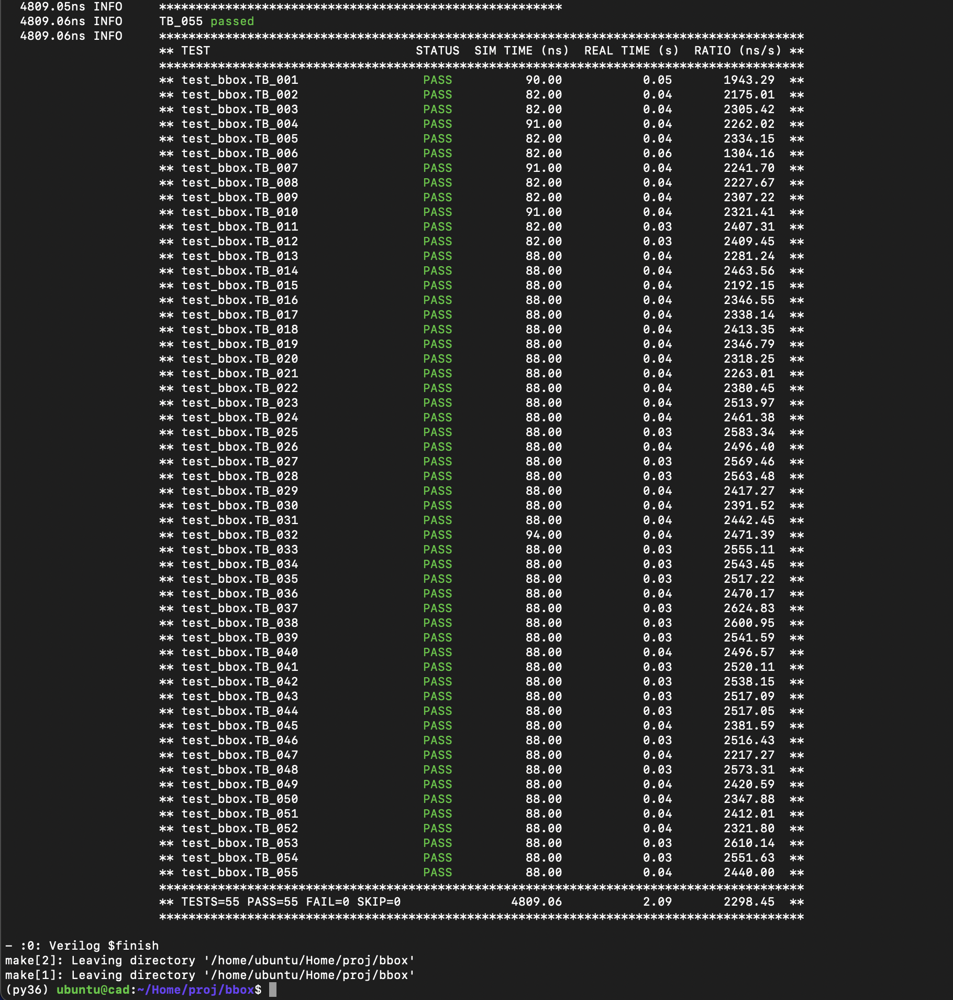
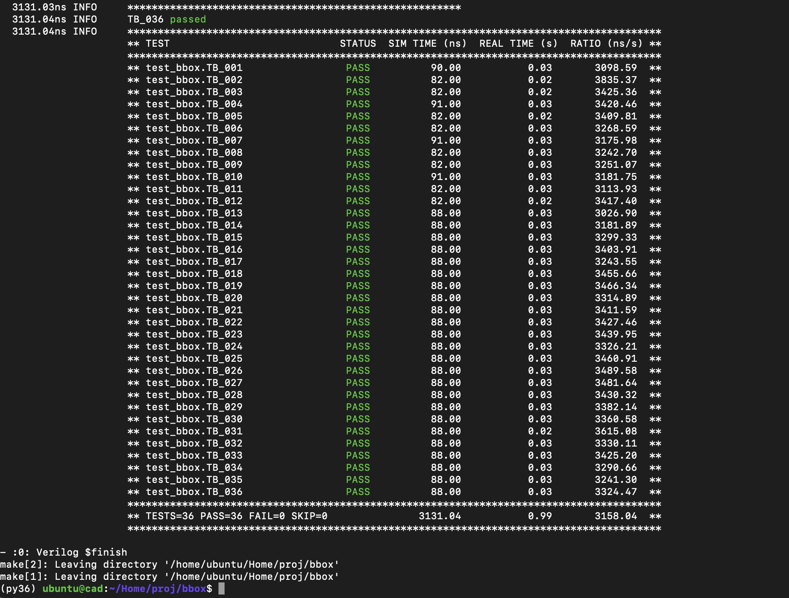

# BitManip Extension project

This is the course project of CS6230: CAD for VLSI, Dept. of CSE, IIT Madras, with the aim of implementing a ratified RISCV Bit Manipulation Instruction Set in Bluespec and verification using COCOTb module in Python

### Bit-Manipulation Extensions

<div align="justify"> The bit manipulation extension comprises of several extensions to the conventional RISC-V architecture, which enables to reduce the code size (each instruction needs to be written using several RV32/64 instructions), also provide improvement on terms of performance and energy. Bit manipulation involves performing operations like shifting, counting etc. on the bits to obtain information or transform them to some application usable format. A wide range of applications are benefitted including error control codes, data compression to address generation for memory accesses. Through this project the RISC-V Bit Manipulation Extension (both RV32/64) has been implemented in Bluespec System Verilog and verified using Python3 (cocotb) in accordance to the specification document. There are four sets of extensions freezed by RISC-V international which have been implemented and they include:  </div>

- Zba, Extensions to accelerate address transalation for accessing basic array types.
- Zbb, Extnesions to perform basic bit manipulation operations like logical with negate, counting, rotate etc. 
- Zbc, Extensions to perform carry-less multiplication.
- Zbs, Extensions to perform single-bit operations like bit clear, set etc. 

### The repo structure is as follows:
- bbox.bsv - The top module of the design. Has the interface definition and module definition which calls the BitManip computation.
- Makefile - Has make commands to generate_verilog and simulate.
- src/ - The directory where the files which the student should edit are present here. The files present are
	- compute.bsv - The top function which selects between the functions implemented for the spec depending on the instruction.
	- bbox.defines - The function which has the macro definition used to select between the instructions.
	- bbox_types.bsv - The structures, enum, bsc macors are defined here.
	- Zba.bsv, Zbb.bsv, Zbc.bsv, Zbs.bsv - Implements the functions to perform respective bit manipulations. 
- bbox_verif/ - The directory where the scripts required for running the cocotb tests are present. The files present are:
	- test_bbox.py - This file consists cocotb testbench for bbox dut. For more info, check Task description provided in this file, as well as the addition of custom tests. 
	- bbox_ref_model.py - This file consists reference model which used in verifying the design (DUT). For more info, check Task description provided in this file. 
- docs/ - The directory where the bitmanip spec pdf, instructions for Tool Setup and some FAQs are present. 

### Interfacing 

<div align="justify"> The inputs and outputs to the design under test are shown as below. In the actual hardware the instruction is passed with appropriate opcodes. To account for the same the structure has been incorporated in 'src/bbox.defines' where the instruction is encoded based on the operation to be performed. Based on the decoded instruction, a result is computed using 'src/compute.bsv' which invokes the corresponding Bluespec extension function. The result is returned to bbox.bsv. In the Python test bench, since the register contents are being passed along side, these parts of the insrtuction shall be passed as 0. The whole instrucion is generated based on the required opcode, along with embedding the shamt value passed by user to get a 32-bit instruction for testing purposes. The func_gen call in the 'bbox_verif/test_bbox.py' serves this purpose of generating the instruction. This instruction is also passed to 'bbox_verif/bbox_ref_model.py', which gives out the result computed in Python and same is compared with result obtained through Bluespec for functional correctness. </div>

| Name | I/O | Size |
| --- | --- | --- |
| bbox_out | O | 65/33|
| CLK | I  | 1  |
| RST_N | I | 1 |
| instr | I | 32 |
| rs1 | I | 64/32 |
| rs2 | I | 64/32 | 


### Steps to run:

<div align="justify"> Make sure you have installed all the required tools as mentioned in docs/Tool_setup.pdf and the python environment is activated. To add custom test instrucions, 
the list corresponding to respective instruction in 'bbox_verif/test_bbox.py' is to be appended and more details have been provided inside the file. Please make sure to change the BSCDEFINES to RV32 along with base in 'bbox_verif/test_bbox.py' to change the base. </div>
-

1. To just generate the verilog
```bash
$ make generate_verilog
```
2. To simulate. NOTE: Does both generate_verilog and simulate.
```bash
$ make simulate
```
3. To clean the build.
```bash
$ make clean_build
```

**_NOTE:_** Change BSCDEFINES macro in Makefile to RV64/RV32 according to use. 

### More info for Verification

```bash
1. First-time run - $ make simulate
   Subsequent runs - $ make clean_build
   		     $ make simulate
```
```bash
2. To check waveforms, - Once simulation completes, dump.vcd is created in bbox/
    $ gtkwave dump.vcd
```    
```bash    
3. GTKWave installation - 
	$ sudo apt update
	$ sudo apt install gtkwave
```    

### Work Split-up: 
- Bachotti Sai Krishna Shanmukh, EE19B009
	- Implementation: Zbb (Sign-Extension), Zbs
	- Verification: Zbs, Zbc, Zbb (Sign-Extension)
	- Bluespec Integration
- Niranjan J Nair, EE19B046
	- Implementation: Zba, Zbc
	- Verification: Zba, Zbc
- Sai Gautham Ravipati, EE19B053
	- Implementation: Zbb (except Sign-Extension) 
	- Verification: Zbb (except Sign-Extension)
	- Python3 testing set-up

### Test Results: 
- The results obtained for both random and custom testcases for RV64 (55 instead of 43 as tested for different values of shamt): 



- The results obtained for both random and custom testcases for RV32 (36 instead of 32 as tested for different values of shamt): 



